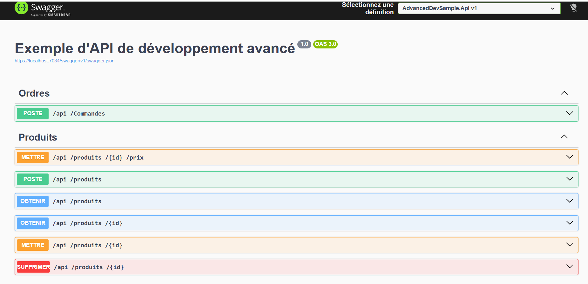


 ##Description

AdvancedDevSample est un exemple d’application .NET structurée selon la Clean Architecture.
Elle met en avant une séparation claire des responsabilités pour assurer :

✔️ Maintenabilité
✔️ Testabilité
✔️ Scalabilité
✔️ Simplicité d’évolution

Ce projet sert de base solide pour démarrer un projet propre en .NET.

Architecture du projet
AdvancedDevSample
│
├── AdvancedDevSample.Api           → API (Controllers, Swagger, DI)
├── AdvancedDevSample.Application   → Logique applicative (Use Cases)
├── AdvancedDevSample.Domain        → Noyau métier (Entités, règles)
├── AdvanceDevSample.Infrastructure → Accès DB, services externes
└── AdvancedDevSample.Test          → Tests unitaires / intégration

Dépendances
API → Application → Domain
Infrastructure → Domain
API → Infrastructure 

 Le Domain ne dépend jamais d’une autre couche.

 Diagramme de Classes

 Détails des couches
 Domain

Entités métier
Interfaces Repository
Règles métier
Aucune dépendance externe

Application

Exceptions
DTO
Services 

 Infrastructure

Implémentation Repository (EF Core…)
Configuration DB
Services externes

 API

Controllers
Routing
Swagger
Middleware
DI

 Tests

Tests unitaires Domain
Tests Application
Tests intégration API
Mocks / Fakes

 Démarrer le projet
1) Cloner
No diagram type detected matching given configuration for text: git clone <repository-url>git clone <repository-url>Afficher plus de lignes
2) Restaurer
Shelldotnet restoreAfficher plus de lignes
3) Lancer
Shellcd AdvancedDevSample.Apidotnet runAfficher plus de lignes
4) Swagger
https://localhost:7034/swagger

