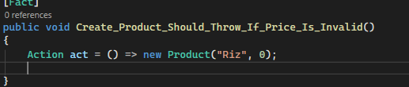

# Qualité du Code - SonarQube

Cette section présente les rapports d'analyse statique du code générés par **SonarQube**. Ces rapports permettent de suivre la dette technique, la couverture de code, et les potentiels bugs ou vulnérabilités.

## Tableau de Bord Général

Cette vue d'ensemble montre les indicateurs clés de performance (KPI) du projet, tels que la fiabilité, la sécurité, et la maintenabilité.

## Analyse Détaillée

Ci-dessous, les détails concernant les problèmes détectés, classés par sévérité.

## Métriques de Code

Visualisation des métriques de complexité et de duplication.

## Solution apportee

